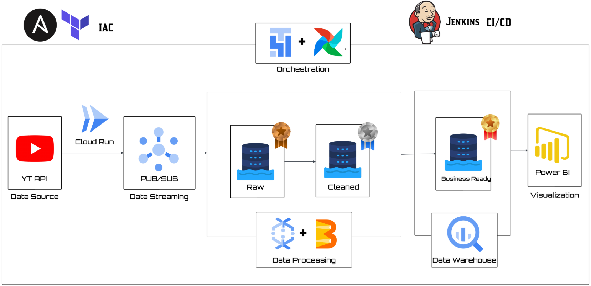

# Real-Time Cloud Data Engineering Pipeline

This project demonstrates a **production-style, end-to-end real-time data engineering pipeline on Google Cloud Platform (GCP)**. The pipeline is fully automated using **Terraform** for infrastructure provisioning, **Ansible** for configuration management, and **Jenkins** for CI/CD orchestration. Live data insights are delivered through interactive **Power BI dashboard**.

In this implementation, **YouTube comments are ingested in near real time**, processed using **NLP-based sentiment analysis**, and streamed across a managed GCP analytics stack.

# System Architecture

